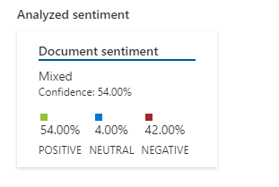
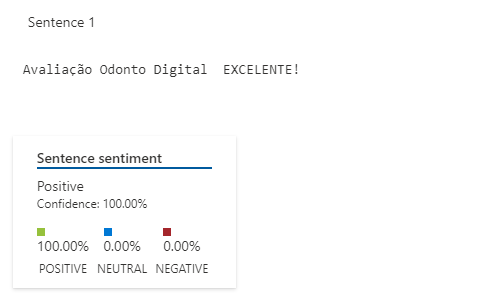
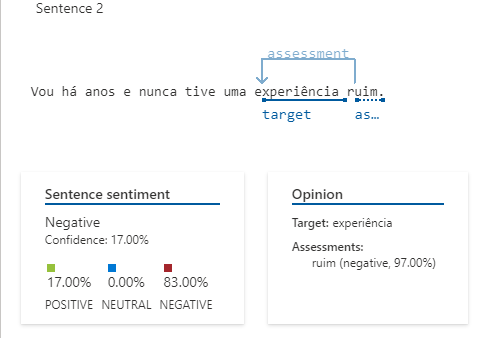

## Language Studio

Link: [language.cognitive.azure.com](http://language.cognitive.azure.com)

Ajuda a fazer analise semântica, das mensagens, textos, etc.

É necessário criar um  recurso do tipo Serviço de Linguagem (Language service).

Dentro do portal do azure acesse Criar um recurso.

Escolha a categoria IA + Machine Learning

Escolha Serviço de Linguagem

Siga as dicas da página para criar um novo recurso.

Em Select additional features, escolha alguma feature adicional se julgar necessário.

Clique em Continue to create your resource.

Em Criar idioma é o método normal para criar recursos no portal do Azure.

Escolha a assinatura.

Escolha o grupo de recursos.

Escolha a região (fora dos EUA tendem a ser mais caros)

Dê um nome único dentro do grupo de recursos.

Escolha o tipo de preço.

Ao terminar clique em Examinar + Criar, será feito uma analise.

Ao final da analise, se estiver tudo certo, clique me Criar, ou corrija o problema.

Agora acesse o Language Studio [language.cognitive.azure.com](http://language.cognitive.azure.com)

Faça login com sua conta do Azure, caso ainda não tenha feito.

Será questionado sobre qual recurso deve utilizar.

Escolha sua Assinatura.

Tipo de recruso

E o recurso Serviço de Linguagem que criou anteriormente.

Clique em Done

Para testar, podemos usar a Analise de sentimentos e opiniões.

Acesse a guia Classify text.

Entra Analyze sentiment and mine opinions.

Escolha o idioma desejado

Insira o texto que deseja ser analisado na caixa de t exto ou envie um arquivo txt com o texto desejado. 

Confirme que vc tem conhecimento que usando essa demonstração implicara em custos para o Recurso do azure escolhido.

Clique em Run para realizar a analisa.

## Insights

Verifiquei que a analise pode errar quando tem uma frase que nega uma afirmação, por exemplo:

    Vou há anos e nunca tive uma experiência ruim.

Foi identificado em Sentence sentiment como:
- 17% Positiva
- 83% Negativa

Para o Opinion:
 - 97% Negativa

**Sentimento do Documento**

**Primeira Sentensa**:

**Segunda Sentensa**:

O texto deve estar bem pontuado, titulos são considerados como sentensas e levam ao entendimento errado sobre sentimentos e opiniões. 
